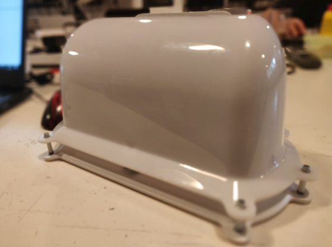

This was a project from my internship at the Waag. I designed and partially manufactured the mechanical components for this low-cost air quality sensor for the project [hollandse luchten](https://hollandse-luchten.org/). During my internship, I went from design to the production of 200 units. 

The project was a collaboration between the Waag, RIVM, and the province of Noord-Holland. The goal was to create a network of air quality sensors that would be placed near TATA steel. The data collected by the sensors would be used to create a map of the air quality in the city. The sensors were designed to be low-cost and easy to assemble so that they could be deployed in large numbers.

<!DOCTYPE html>
<html lang="en">
<head>
    <meta charset="UTF-8">
    <meta name="viewport" content="width=device-width, initial-scale=1.0">
    <title>Image Layout</title>
    
</head>
<body>
    

        

            
            
Real World Example

        

        

            
            
3D Render Shortened Version

        

        

            
            
3D Render Extended Version

        

        

            
            
Inside Real World

        

    

</body>
</html>
